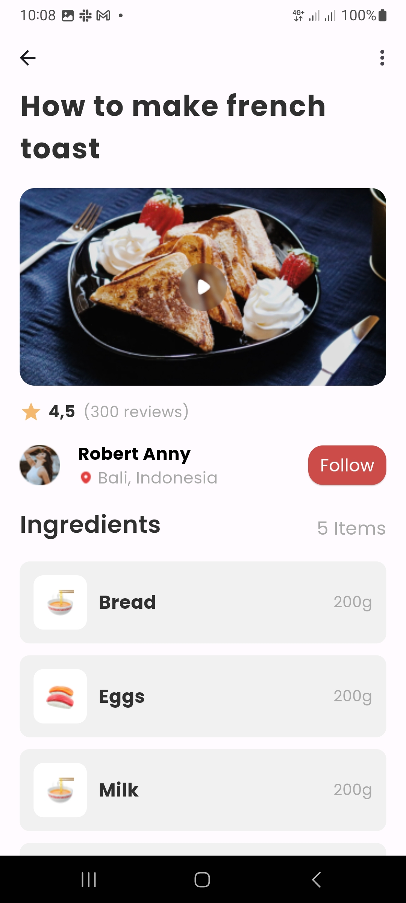
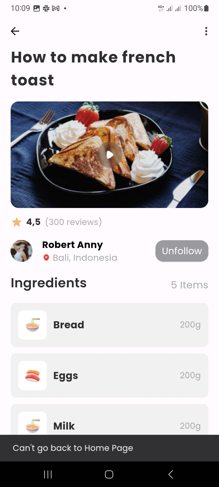
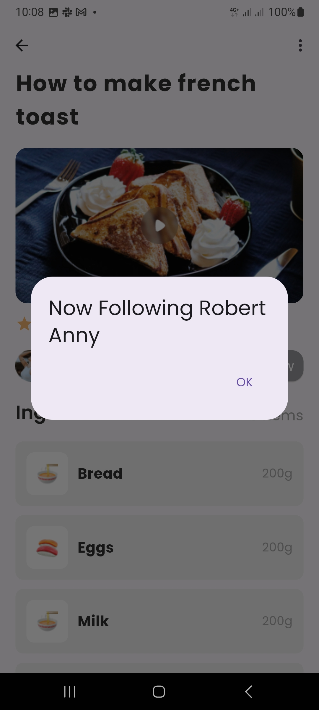
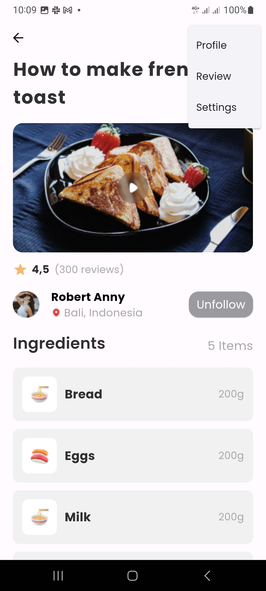

# Food Recipe Application

Welcome to FoodRecipe App! This Flutter project is designed to provide you with a seamless cooking experience by offering step-by-step video tutorials for various recipes along with detailed ingredient lists. Whether you're a beginner or an experienced chef, FoodRecipe App has something for everyone to explore and enjoy.

## Screenshots

### Screen 1 - MakePage




### Screen 1 Functionalities
<div style="display: flex; justify-content: center;">
    
    
    
</div>


## Getting Started

Certainly! Below is a "Get Started" section for your Flutter app's README.md file:

```markdown
## Get Started

Follow these steps to get started with the FoodRecipe Flutter app:

### Prerequisites

- Ensure that you have Flutter installed on your machine. If not, you can follow the [official installation guide](https://flutter.dev/docs/get-started/install).
- Make sure you have a compatible IDE installed such as Visual Studio Code, Android Studio

### Clone the Repository

```bash
git clone https://github.com/ProminenceFM/foodrecipe
```


### Install Dependencies

Navigate to the project directory and run the following command to install the required dependencies:

```bash
flutter pub get
```

### Run the App

Connect your device or start an emulator, then run the following command:

```bash
flutter run
```

This command will build the app and deploy it to your device or emulator.

### Explore the Code

Once the app is running, explore the codebase to understand its structure and functionality. You can start by examining the `lib` directory where most of the app's Dart code resides.

### Customize and Build

Feel free to customize the app to fit your requirements. You can modify existing features, add new ones, or change the app's design. Use Flutter's rich set of widgets and libraries to bring your ideas to life.

### Feedback and Contributions

We welcome feedback, bug reports, and contributions from the community. If you encounter any issues or have suggestions for improvement, please open an issue on our [GitHub repository](<repository-url>). We appreciate any contributions, whether they are bug fixes, feature enhancements, or documentation improvements.

### Enjoy Cooking!

With the FoodRecipe app set up on your device, you're now ready to explore a wide range of delicious recipes and enhance your cooking skills. Happy cooking!
```


## Dependencies

List of external dependencies used in the project.

- [shimmer](https://pub.dev/packages/shimmer) - Used for adding shimmering effect.


